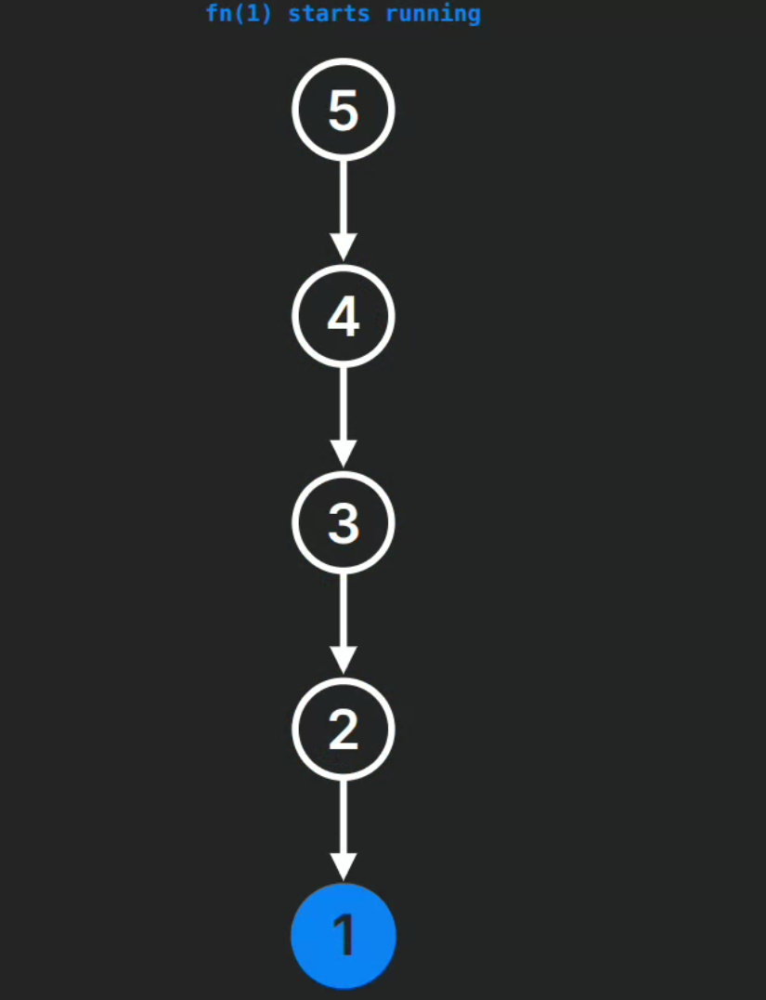
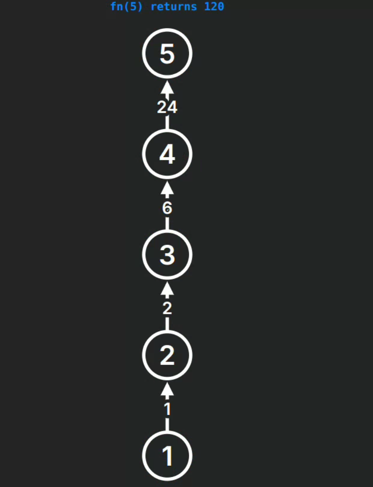

# RECURSION

## Definition

Recursion is a programming concept where a function calls itself to solve a problem by breaking it down into smaller, similar subproblems. A recursive function has two main components:

| Component | Description |
|-----------|-------------|
| **1. Base case(s)** | - The condition(s) that stop the recursion<br>- Returns a value without making another recursive call<br>- Prevents infinite recursion |
| **2. Recursive case(s)** | - The function calls itself with modified parameters<br>- Makes progress toward the base case<br>- Breaks down the problem into smaller instances |
| **Key characteristics** | - Must eventually reach a base case to terminate<br>- Can often replace loops<br>- May consume more memory due to call stack usage |

## Stack Space and Stack Overflow

### Stack Space in Recursion
```cpp
void recursiveFunction(int n) {
    // Each call creates a new stack frame
    if (n == 0) return; // Base case
    recursiveFunction(n - 1); // Recursive call
}

int main() {
    recursiveFunction(10);
}
```
- Each recursive call adds a new frame to the call stack
- Stack frame contains: local variables, parameters, return address
- Memory is allocated in stack for each function call

#### Stack Frame Visualization
```
Stack Growth
│           │
│  call n-2 │
├───────────┤
│  call n-1 │
├───────────┤
│  call n   │
└───────────┘
    ...
```

### Stack Overflow
```cpp
void countDown(int n) {
    // Missing base case
    printf("%d ", n);
    countDown(n - 1); // Will continue indefinitely
}

int main() {
    countDown(5); // Will eventually cause stack overflow
    return 0;
}
```
- Occurs when recursive depth exceeds available stack memory
- Common causes:
  - Missing base case (as shown above)
  - Too many recursive calls
  - Large local variables in recursive functions


## Recursion Tree

After understanding how recursive calls use stack space, visualizing the sequence of calls helps in:
- Understanding the flow of execution
- Tracking the values at each step
- Identifying potential stack overflow situations

A recursion tree visualizes the sequence of recursive calls and their return values:
### Example: Factorial Function
```cpp
int factorial(int n) {
    // Base case
    if (n == 1) return 1;
    
    // Recursive case
    return n * factorial(n - 1);
}

int main() {
    int result = factorial(5); // Output: 120
    return 0;
}
```

```cpp
fn(5) = 5 * fn(4)
    |
    ├── fn(4) = 4 * fn(3)
    |           |
    |           ├── fn(3) = 3 * fn(2)
    |           |           |
    |           |           ├── fn(2) = 2 * fn(1)
    |           |           |           |
    |           |           |           └── fn(1) = 1
    |           |           └── Return: 2 * 1 = 2
    |           └── Return: 3 * 2 = 6
    └── Return: 4 * 6 = 24
Return: 5 * 24 = 120
```


<div style="display: flex; justify-content: space-between;">
<div>

</div>
<div>

</div>
</div>


> Online Recursion Visualization Tool
    - You can visualize recursion in real-time using [this online tool](https://recursion.vercel.app/).

Each level represents:
- Current function call
- Calculation being performed
- Return value propagating up

This helps in:
- Understanding execution flow
- Analyzing time complexity
- Debugging recursive algorithms


